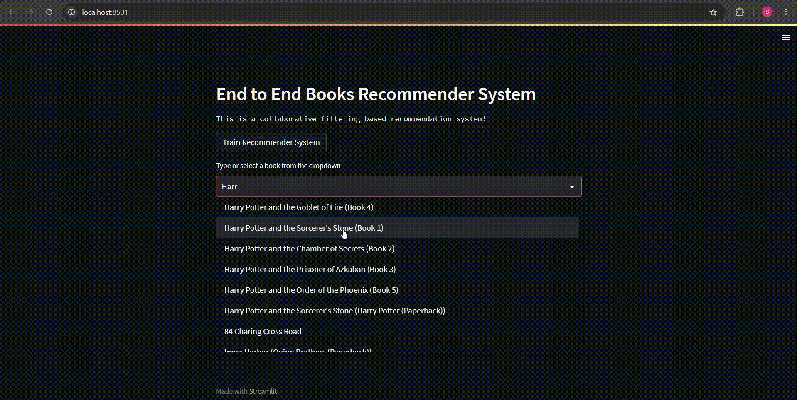

# End-to-end-Book-Recommender-System

## Workflow

- config.yaml
- entity
- config/configuration.py
- components
- pipeline
- main.py
- app.py


# How to run?

### STEPS:

Clone the repository

```bash
https://github.com/sarveshhh98/End-to-End-book-recommender-system
```
### STEP 01- Create a conda environment after opening the repository

```bash
conda create -n books python=3.7.10 -y
```

```bash
conda activate books
```


### STEP 02- install the requirements
```bash
pip install -r requirements.txt
```


# 📚 End-to-End Book Recommender System

An end-to-end Machine Learning Book Recommender System that recommends books based on user preferences using collaborative filtering and popularity-based recommendation techniques. The project covers the complete ML lifecycle including data preprocessing, model building, serialization, and deployment through an interactive Streamlit web application.

---

# 🎥 Live Demo

> 📺 Click the image below to watch the complete demo.



---

# 🚀 Features

- Personalized Book Recommendations
- Popular Books Dashboard
- Similar Book Recommendations
- Interactive Streamlit UI
- End-to-End ML Pipeline
- Model Serialization using Pickle
- Modular Project Structure
- Logging & Exception Handling
- Configuration Driven Architecture

---

# 🏗️ Project Architecture

```
Data Collection
        │
        ▼
Data Cleaning
        │
        ▼
Feature Engineering
        │
        ▼
Recommendation Model
        │
        ▼
Pickle Model Files
        │
        ▼
Streamlit Application
```

---


# ⚙️ Installation

### Clone Repository

```bash
git clone https://github.com/yourusername/End-to-End-book-recommender-system.git
```

### Create Conda Environment

```bash
conda create -n books python=3.7 -y
```

```bash
conda activate books
```

### Install Requirements

```bash
pip install -r requirements.txt
```

### Run Pipeline

```bash
python main.py
```

### Launch Streamlit

```bash
streamlit run app.py
```

---

# 🧠 Machine Learning Workflow

- Data Collection
- Data Validation
- Data Transformation
- Recommendation Engine
- Model Serialization
- Streamlit Deployment

---

# 📊 Dataset

Dataset used:

- Books
- Users
- Ratings

Source:

- Kaggle Book Recommendation Dataset

---

# 💻 Tech Stack

| Category | Technology |
|-----------|------------|
| Language | Python |
| ML | Scikit-Learn |
| Data Processing | Pandas, NumPy |
| Visualization | Matplotlib |
| Web App | Streamlit |
| Version Control | Git & GitHub |

---

# ⭐ Future Improvements

- User Login
- Content-Based Recommendation
- Hybrid Recommendation System
- Deep Learning Recommendation
- Docker Deployment
- CI/CD Pipeline
- Cloud Deployment (AWS)

---

# 👨‍💻 Author

**Sarvesh Sapkale**

Data Scientist | Machine Learning Engineer

LinkedIn: https://linkedin.com/in/sarveshhh98

GitHub: https://github.com/sarveshhh98

---

If you found this project helpful, consider giving it a ⭐.
